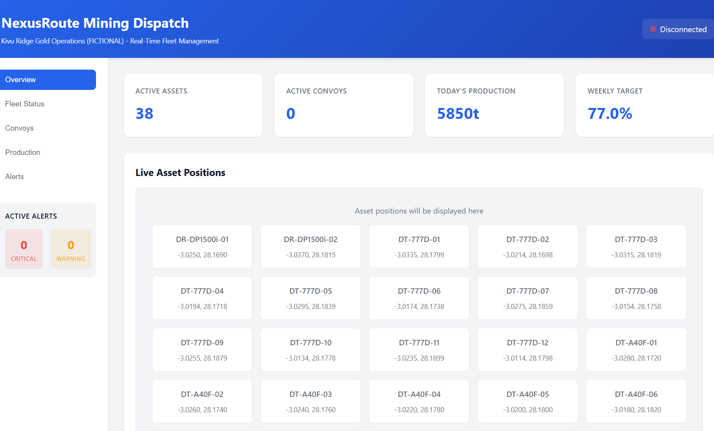
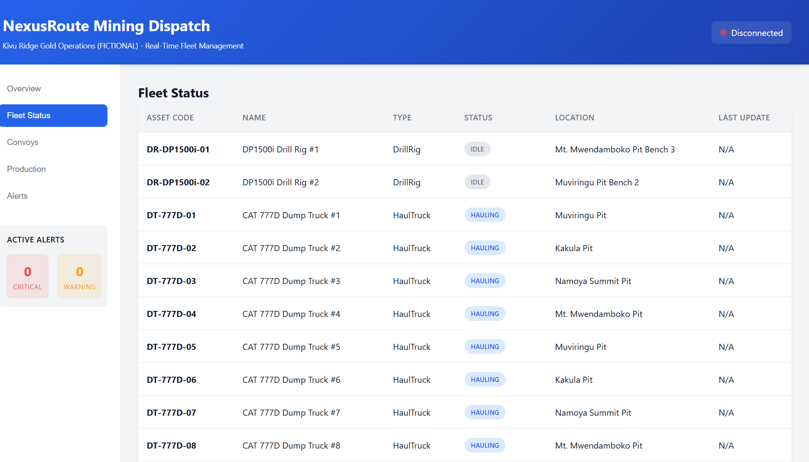
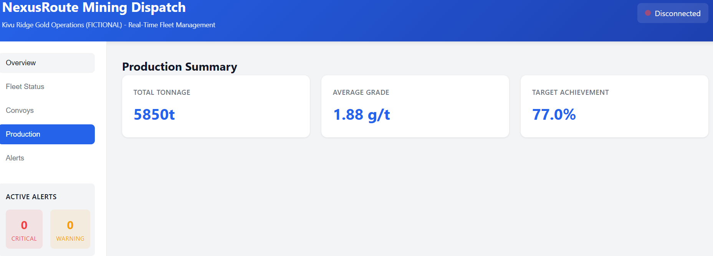
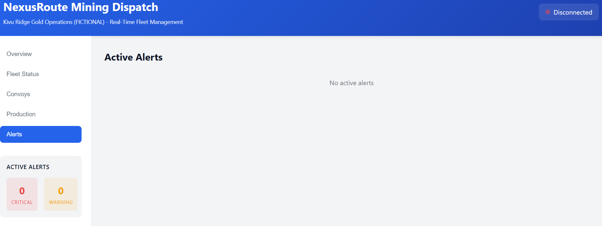
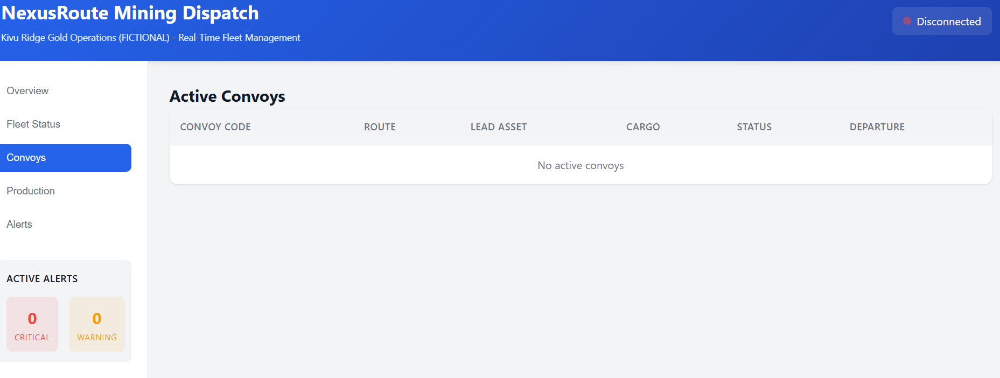
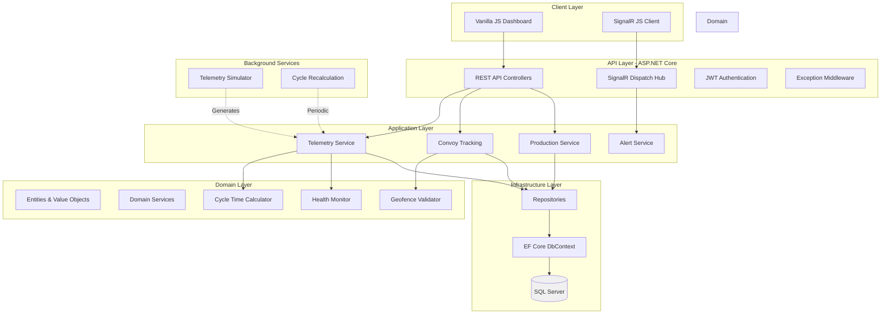

# NexusRoute Mining

**Real-Time Pit-to-Plant Fleet Dispatcher for Mining Operations**

[](https://github.com/JuniorDieka/nexusroute-mining/actions)
[](LICENSE)
[](https://dotnet.microsoft.com/)
[](https://www.docker.com/)
[](https://dotnet.microsoft.com/apps/aspnet/signalr)

> **Note**: This project is inspired by the author's professional experience in open-pit gold mining operations in eastern DRC. The software, simulated data, and operational scenarios are created for portfolio demonstration purposes and do not represent actual operational systems, proprietary data, or confidential information from any former employer.

## 🎯 Overview

NexusRoute Mining is a production-grade, real-time fleet dispatch and telemetry platform designed for open-pit mining operations. Built with .NET 10 and modern web technologies, it demonstrates enterprise-level architecture, real-time data streaming, and complex domain logic in a mining context.

---

## 📸 Visual Journey

Experience the application through these screenshots showcasing real-time fleet management at Namoya Mine with 38 active assets across 4 open pits.

### Dashboard Overview
Real-time metrics showing **38 active assets**, **5,850 tonnes** produced today, and **77% weekly target** achievement.



---

### Fleet Status
Complete fleet monitoring across **4 Namoya pits**: Mt. Mwendamboko, Muviringu, Kakula, and Namoya Summit. Track excavators, haul trucks, drill rigs, and support equipment in real-time.



---

### Production Summary
Daily production metrics: **5,850t total tonnage**, **1.88 g/t gold grade**, and **77% target achievement** tracking.



---

### Alerts System
Active monitoring with **0 critical** and **0 warning** alerts. System operating normally with comprehensive alert management.



---

### Convoy Management
Secure convoy tracking for high-value cargo transport with route monitoring and checkpoint compliance.



---

### Key Features

- **📡 Real-Time Telemetry Ingestion** - Continuous monitoring of equipment health (engine temp, tire pressure, payload, fuel)
- **🚛 Pit-to-Plant Cycle Optimization** - Automated cycle time calculation and bottleneck detection
- **🛡️ Secure Convoy Tracking** - Geofence monitoring and checkpoint compliance for high-value cargo
- **⚠️ Predictive Asset Health Alerts** - Threshold-based warnings before equipment failures
- **📊 Production Tracking** - Real-time tonnage aggregation and grade control
- **🎮 Built-in Simulator** - Zero-hardware demo mode with realistic synthetic data

## 🏗️ Architecture



## 🚀 Quick Start (Docker - One Command)

**Prerequisites**: Docker and Docker Compose installed

```bash
# Clone the repository
git clone https://github.com/yourusername/nexusroute-mining.git
cd nexusroute-mining

# Start everything (API + SQL Server + Simulator)
docker-compose up -d

# Wait ~30 seconds for migrations and seeding
# Open browser to http://localhost:5000
```

The dashboard will show live telemetry, alerts, and convoy tracking with zero configuration!

## 🛠️ Local Development Setup

### Prerequisites

- [.NET 10 SDK](https://dotnet.microsoft.com/download/dotnet/10.0)
- SQL Server 2022 (or Docker)
- Visual Studio 2026 / VS Code with C# Dev Kit

### Setup Steps

```bash
# 1. Clone and restore
git clone https://github.com/yourusername/nexusroute-mining.git
cd nexusroute-mining
dotnet restore

# 2. Configure connection string
# Edit src/NexusRoute.Api/appsettings.json
# Update ConnectionStrings:DefaultConnection

# 3. Run migrations
cd src/NexusRoute.Api
dotnet ef database update

# 4. Run the API
dotnet run

# 5. Open browser to https://localhost:5001 or http://localhost:5000
```

### Configuration

Key settings in `appsettings.json`:

| Setting | Description | Default |
|---------|-------------|---------|
| `ConnectionStrings:DefaultConnection` | SQL Server connection | `localhost,1433` |
| `Jwt:SecretKey` | JWT signing key (min 32 chars) | See appsettings.Example.json |
| `Simulator:Enabled` | Enable telemetry simulator | `true` |
| `Simulator:TelemetryIntervalSeconds` | Telemetry generation frequency | `5` |

**Security**: Never commit secrets! Use User Secrets for development:

```bash
dotnet user-secrets set "Jwt:SecretKey" "YourSecureKeyHere"
```

## 🧪 Running Tests

```bash
# Run all tests
dotnet test

# Run with coverage
dotnet test /p:CollectCoverage=true

# Run specific test project
dotnet test src/NexusRoute.Tests/NexusRoute.Tests.csproj
```

### Test Coverage

- ✅ Domain logic (cycle time, geofence, health monitoring)
- ✅ Repository operations
- ✅ API endpoint integration tests
- ✅ SignalR hub tests with Testcontainers

## 📡 API Documentation

Once running, access Swagger UI at: `http://localhost:5000/swagger`

### Key Endpoints

**Telemetry**
- `POST /api/telemetry` - Ingest telemetry data
- `GET /api/telemetry/recent?minutes=30` - Get recent telemetry

**Assets**
- `GET /api/assets` - List all assets
- `GET /api/assets/{id}` - Get asset by ID

**Convoys**
- `GET /api/convoys/active` - Get active convoys
- `POST /api/convoys/{id}/monitor` - Monitor convoy position

**Production**
- `GET /api/production/summary` - Production summary
- `GET /api/production/daily` - Daily production data

**Alerts**
- `GET /api/alerts/active` - Get active alerts
- `POST /api/alerts/{id}/acknowledge` - Acknowledge alert

### SignalR Hub

Connect to `/hubs/dispatch` for real-time updates:

**Server → Client Events**
- `ReceiveTelemetryUpdate(telemetry)`
- `ReceiveAssetStatusUpdate(asset)`
- `ReceiveAlert(alert)`
- `ReceiveConvoyUpdate(convoy)`
- `ReceiveProductionUpdate(production)`

## 🎮 Demo Mode (Simulator)

The built-in simulator generates realistic telemetry for a fleet of haul trucks:

- **Normal Operations**: Typical temperature, pressure, payload, fuel readings
- **Alert Triggers**: 5% chance of generating threshold violations
- **Position Updates**: GPS coordinates with realistic drift
- **Convoy Simulation**: Scheduled convoys with checkpoint monitoring

Enable/disable in `appsettings.json`:

```json
{
  "Simulator": {
    "Enabled": true,
    "TelemetryIntervalSeconds": 5
  }
}
```

## 🏭 What This Demonstrates

### For Technical Reviewers

**Real-Time Architecture**
- SignalR for bi-directional communication
- Event-driven telemetry ingestion
- Debounced high-frequency data streams

**Clean Architecture**
- Domain-driven design with rich entities
- Separation of concerns across layers
- Dependency injection throughout

**Non-Trivial Domain Logic**
- Haversine distance calculations for geofencing
- Cycle time computation from event logs
- Bottleneck detection algorithms
- Threshold-based health monitoring
- Weighted grade aggregation

**Production Readiness**
- Structured logging (Serilog)
- Health checks
- Exception handling middleware
- JWT authentication with roles
- EF Core with indexes and migrations
- Async/await with CancellationToken

**Testing**
- Unit tests for domain logic
- Integration tests with WebApplicationFactory
- Testcontainers for SQL Server
- SignalR hub testing

**DevOps**
- Docker multi-stage builds
- Docker Compose orchestration
- GitHub Actions CI pipeline
- Database migrations on startup

## 📊 Technology Stack

| Layer | Technology |
|-------|-----------|
| **Runtime** | .NET 10, C# 13 |
| **API** | ASP.NET Core Web API |
| **Real-Time** | SignalR |
| **Database** | SQL Server 2022 + EF Core 10 |
| **Validation** | FluentValidation |
| **Logging** | Serilog |
| **Testing** | xUnit, FluentAssertions, Moq, Testcontainers |
| **Frontend** | Vanilla JavaScript (ES Modules), HTML5, CSS3 |
| **Containerization** | Docker, Docker Compose |
| **CI/CD** | GitHub Actions |

## 📁 Project Structure

```
NexusRoute-mining/
├── src/
│   ├── NexusRoute.Domain/          # Core business logic
│   │   ├── Entities/                # Asset, Telemetry, Convoy, etc.
│   │   ├── ValueObjects/            # GpsPosition, Geofence, CycleTime
│   │   ├── Enums/                   # AssetType, AlertSeverity, etc.
│   │   └── Services/                # Domain services (calculators, validators)
│   ├── NexusRoute.Application/      # Use cases and DTOs
│   │   ├── DTOs/                    # Data transfer objects
│   │   ├── Services/                # Application services
│   │   ├── Validators/              # FluentValidation validators
│   │   └── Interfaces/              # Service interfaces
│   ├── NexusRoute.Infrastructure/   # Data access
│   │   ├── Data/                    # DbContext, configurations
│   │   ├── Repositories/            # Repository implementations
│   │   └── Seed/                    # Data seeding
│   ├── NexusRoute.Api/              # REST API + SignalR
│   │   ├── Controllers/             # API controllers
│   │   ├── Hubs/                    # SignalR hubs
│   │   ├── Middleware/              # Custom middleware
│   │   ├── Authentication/          # JWT configuration
│   │   └── wwwroot/                 # Frontend (HTML/CSS/JS)
│   ├── NexusRoute.Simulator/        # Telemetry simulator
│   │   └── Services/                # Background services
│   └── NexusRoute.Tests/            # Tests
│       ├── Unit/                    # Unit tests
│       └── Integration/             # Integration tests
├── docker-compose.yml               # Docker orchestration
├── Dockerfile                       # Multi-stage build
└── README.md                        # This file
```

## 🔐 Security

- **Authentication**: JWT Bearer tokens with role-based authorization
- **Authorization**: Role-based access control (Dispatcher, Maintenance, Operator)
- **SQL Injection**: EF Core parameterized queries
- **HTTPS**: Enforced in production
- **Secrets**: User Secrets for development, environment variables for production

**Roles**:
- `Dispatcher` - Full access to fleet and convoy management
- `Maintenance` - Asset health monitoring and alerts
- `Operator` - Production logging and telemetry submission

## 🐛 Troubleshooting

**Database connection fails**
```bash
# Check SQL Server is running
docker ps | grep sqlserver

# Verify connection string in appsettings.json
# Ensure TrustServerCertificate=True for local development
```

**SignalR not connecting**
- Check browser console for errors
- Verify WebSocket support in browser
- Check CORS settings if running frontend separately

**Simulator not generating data**
- Verify `Simulator:Enabled` is `true` in appsettings.json
- Check logs for simulator startup messages
- Wait 10-15 seconds after startup for first telemetry

## 🤝 Contributing

Contributions are welcome! Please read [CONTRIBUTING.md](CONTRIBUTING.md) for guidelines.

## 📄 License

This project is licensed under the MIT License - see [LICENSE](LICENSE) for details.

## 🙏 Acknowledgments

- Fictional scenario inspired by real-world mining operations
- Built as a portfolio demonstration of .NET enterprise architecture
- All data, locations, and operations are entirely fictional

## 📧 Contact

For questions or feedback, please open an issue on GitHub.

---

**Remember**: Kivu Ridge Gold Operations is **FICTIONAL**. This project is for demonstration and educational purposes only.

---

Built with ❤️ for Mining real-time fleet dispatch excellence
